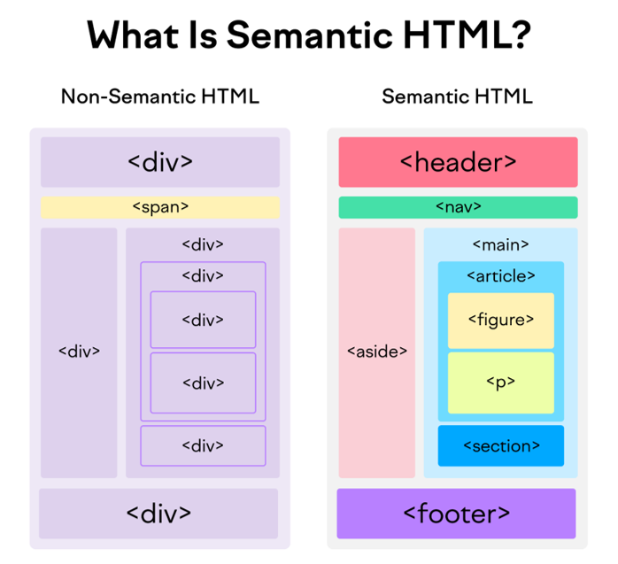

# HTML

---

<details>
<summary>Index</summary>

## Index

- Introduction
- Elements
- Structure
- Hyperlinks
- Embedding
- List
- Table
- Forms
- Important Elements
- Attributes
- Tricky Questions

</details>

---

<details>
<summary>Introduction</summary>

## Introduction

- **HTML** stands for **Hypertext Markup Language**
- Hypertext is special text, not regular text.
- you can create links with text that you can interact with by clicking or hovering.
- Markup refers to tags added to text to define structure or meaning.
- Tags tells the browser how to display text (like headings, paragraphs, links ...etc).
- Tags are used as instructions for formatting content.


### About HTML

- **HTML** stands for **Hypertext Markup Language**
- **HTML** is used to create static web pages.
- **HTML** is used to create skeleton of the webpage.
- Text Editor (Notepad) is the software for **HTML** coding.
- **HTML** file save with extension `.html`

### HTML coding

- **HTML** coding is a `Tag` based coding.
- Tags tells the browser how to display text (like headings, paragraphs, links ...etc).
- Tags are used as instructions for formatting content.

### **HTML** Tags are two types

1. **Container Tag** : It has startTag & endTag.
2. **Empty Tag** : It doesn't have an end tag.

- `Container Tag`

  ```html
  <h1>Heading</h1>
  <p>Paragraph</p>
  ```

- `Empty Tag`

  ```html
  <br />
  <hr />
  ```

- **HTML** elements define the structure and meaning of the content.
- With the help of HTML elements, the browser understands how to display the content on the webpage.

### **HTML** document Structure

```html index.html
<!DOCTYPE html>
<html>
	<head>
		Metadata Elements
	</head>
	<body>
		Content of Webpage
	</body>
</html>
```

An **HTML** document consists of three parts :

1. **DOCTYPE**

- The **DOCTYPE** declaration tells the type/version of the HTML document to the browser.

2. **Head Part**

- Head tag is for **Browser reading** purpose.
- Here, we can mention `HTML` page configuration information.
- Here, we can store title, style sheets, scripts, metadata...etc.

3. **Body Part**

- Body tag is for **Client reading** purpose.
- Here, we can Display content of the webpage.
- It contains text content, headings, paragraphs, links, tables, forms, images, audios, videos, ...etc.

### Element Syntax

- Element consist of a **startTag** and **endTag**.
- we can put **content** between **startTag** and **endTag**.

```html
<tag>Content</tag>
```

```html
<h1>I am Heading Tag</h1>
```

### Attribute syntax

- Attributes are used to give extra information to the html element.
- we must mention attributes only in **startTag**.

```html
<tag attributeName="attributeValue">Content</tag>
```

```html

```

### Uses of **HTML**

1. **Structuring web pages**
   - we can define headings, paragraphs, and other content of a web page.
2. **Creating Hyperlinks**
   - Hyperlink is used to navigate to other web resources or a specific element within the HTML document.
3. **Embedding**
   - we can embed images, audios and videos in the HTML document.

### Advantages & Disadvantages of **HTML**

- we can create only Static Web pages (skeleton of the web page) with HTML alone.
- By Combining HTML with CSS, we can create Responsive web pages.
- By Combining HTML with JavaScript, we can create dynamic web pages.

### HTML version

- `HTML5` is the latest version of HTML.
- HTML5 is easier than HTML4 or Older versions.

- In HTML5 version, they added new features,

  - picture, audio and video elements
    - `<picture>, <audio>, <video>`
  - semantic elements
    - `<header>, <nav>, <aside>, <main>, <footer>`

**`HTML5` Declaration** :

```html
<!DOCTYPE html>
```

</details>

---

<details>
<summary>Elements</summary>

## Elements

### **HTML** Tags are two types

1. **Container Tag** : It has startTag & endTag.
2. **Empty Tag** : It does not have an endTag.

In general, HTML elements can be divided into two categories.

1. Block-Level Elements
2. Inline Elements

### Block-Level Elements

- HTML Block-Level element occupies the entire horizontal space of its parent element.
- HTML Block-Level element always start in a new line.

```html
<h1>Heading</h1>
<p>I am Paragraph.</p>
```

#### Block-Level Tags

- heading
  - `h1, h2, h3, h4, h5, h6`
- paragraph
  - `p`
- containers
  - `header, nav, aside, main, section, article, div, footer`

```html
<body>
	<h1>I am Heading 1</h1>
	<p>I am Paragraph</p>
	<div>
		<h2>I am Heading 2</h2>
	</div>
</body>
```

### In-Line Elements

- Inline element occupies content width only.
- The HTML Inline elements do not start on a new line.

```html
<p>I am <a href="https://www.google.com">Google</a> link</p>
<p>I am <span class="my-style">Ande Praveen</span></p>
```

#### In-Line Tags

- Buttons
  - `button`
- Links
  - `a`
- Text Styles
  - `span`
- Text Format
  - bold : `b`
  - italic :`i`
  - underline : `u`

### Nested **HTML**

The HTML element can be placed inside **another** HTML element is called Nested Element.

```html
<div>
	<h1>Heading</h1>
	<p>I am paragraph.</p>
</div>
```

</details>

---

<details>
<summary>Structuring</summary>

## Structuring

1. Heading Elements
2. paragraph Element
3. Line Break
4. Horizontal Line
5. Containers

### Heading Elements

- HTML defines six levels of headings.

  - `h1, h2, h3, h4, h5, h6`

- The HTML `h1` element defines the most important heading of an HTML document.
- The HTML `h6` element defines the least important heading of an HTML document.

```html
<h1>heading 1</h1>
<h2>heading 2</h2>
<h3>heading 3</h3>
<h4>heading 4</h4>
<h5>heading 5</h5>
<h6>heading 6</h6>
```

### Paragraph Element

- The HTML Paragraph Element defines the paragraph of an HTML document.

```html
<p>I am Paragraph</p>
```

### Line Break

- The HTML `<br/>` Element helps to break the text and continue it in the next line.
- The HTML `<br/>` element is a void element.

```html
<p>
	Twinkle, twinkle, little star, <br />
	How I wonder what you are! <br />
	Up above the world so high, <br />
	Like a diamond in the sky.
</p>
```

### Horizontal line

The HTML `<hr/>` element inserts a horizontal line and helps to separate the content.

```html
<h1>Heading</h1>
<hr />

<p>I am Paragraph</p>
```

### Containers

- The Container Elements are used to wrap a group of elements and apply CSS styles to many elements at once.
- These container tags are used to divide smaller parts for understanding and applying css easily.

#### 1. Semantic Tags

- **Semantic** elements have the meaning.
- Semantic Tags are useful for client reading purpose, browser reading purpose and also Developer reading purpose.
- The HTML semantic elements describe the **meaning** of content in between the startTag and endTag.

- **uses of Semantic HTML tags:**

1. **Accessibility**

- This is because screen readers and browsers can understand the code better.
  We can use shortcuts to move different parts within the webpage.

2. **Search Engine Optimization**

- It improves the website Search Engine Optimization Rankings which increases the number of people that visit our webpage.

3. **Easy to Understand**
   - It makes our code more readable and easier to understand.

- Semantic Tags :

1. **header**
2. **nav** -> navbar
3. **aside** -> side bar
4. **main** -> main content
5. **section**
6. **article**
7. **footer**



```html
<header>
	<h1>heading</h1>
</header>

<nav>
	<h2>navbar</h2>
</nav>

<aside>
	<h2>aside</h2>
</aside>

<main>
	<h2>main content</h2>
</main>

<section>
	<article>
		<h2>the story</h2>
	</article>
</section>

<footer>
	<h2>footer</h2>
</footer>
```

### Non-Semantic Tags

- Non-semantic elements don't have the meaning.
- They can contain anything.
- Examples: `div` and `span`.

- **div** container tag => divided & use css
- `<div>` is used to group a set of elements.

```html
<div>
	<h1>I am Heading 1</h1>
</div>
```

- **span** is an In-Line Element.
- This span element used to apply some css styles for a particular character, word , group of words.
- content comes side by side.

```html
<p>I am <span class="my-style">Ande Praveen</span></p>
```

### details

- We can create accordion by using **details** tag.
- It has two states:
  1. open: We can see the additional information.
  2. close: We can't see the additional information. We can see only the summary.

```html
<details>
	<summary>Details</summary>
	show Hidden Content by click on Details Summary.
</details>
```

</details>

---

<details>
<summary>Hyperlinks</summary>

### Hyperlinks

- **Hyperlink** is used to navigate to other web resources or a specific element within the HTML document.
- We can create hyperlinks to **text** as well as **images**, **buttons**, ...etc.

- we can create Hyperlink with HTML **anchor** element.

```html
<a href="link">Text</a>
<a href="link"> <button>Click Here</button> </a>
<a href="link">  </a>
<a href="#myHeading">Goto Heading</a>
```

</details>

---

<details>
<summary>Embedding</summary>

## Embedding

- HTML media elements are used to present the **pictures**, **audios** and **videos**.

### Display Image

- We can display images on the web page using the HTML `img` element.
- `src` attribute tells the path to the image.
- `alt` attribute gives an alternate text for the image.

```html

```

### picture

The HTML `picture` element is a container to provide multiple alternative sources for the HTML `img` element. It is useful in different display/device scenarios.
It can contain zero or more source elements and one HTML img element.

```html
<picture>
	<source media="(min-width:650px)" srcset="image-1" />
	<source media="(min-width:465px)" srcset="image-2" />
	
</picture>
```

- The HTML `srcset` attribute specifies the alternative source/path of the img element.
- The HTML `media` attribute specifies the media query. CSS properties will be applied based on the device type and media features like min-width, ...etc.

### video

- We can insert a video to the HTML document using video element.
- The HTML `controls` attribute is used to set controls in HTML `video` element. It is a boolean attribute. When **controls** attribute is present, it specifies that video controls should be displayed.

Video controls include:

- Play
- Pause
- Volume
- Full screen toggle

```html
<video controls>
	<source src="movie.mp4" type="video/mp4" />
	<source src="movie.webm" type="video/webm" />
	<source src="movie.ogv" type="video/ogg" />
	Your browser does not support the video tag.
</video>
```

- The HTML `source` element defines the media resource for the HTML video element.

- The HTML `src` attribute specifies the URL/path of the media resource (e.g. video).
- The HTML `type` attribute specifies the type/format of the media resource(e.g. video/mp4)

### audio

- The HTML audio element represents a sound or audio stream. It is used to play an audio file on an HTML document.

```html
<audio controls>
	<source src="horse.ogg" type="audio/ogg" />
	<source src="horse.mp3" type="audio/mpeg" />
	Your browser does not support the audio element.
</audio>
```

- The HTML source element specifies multiple alternative media resources for HTML picture element or for media elements (audio, video, etc.).
- It is commonly used to give the same media content in multiple file formats for providing compatibility across different browsers.
- The HTML `src` attribute of the source element specifies the URL/path of the media resource.

### iframe

Some of the uses of HTML `iframe` element are:

- We can embed HTML documents within the current HTML document.
- We can insert pdf, docs ...etc.
- We can embed videos within the current HTML document, ...etc.

```html
<iframe src="https://www.youtube.com/embed/y881t8ilMyc"></iframe>
```

The HTML `src` attribute specifies the URL/path of the video.

</details>

---

<details>
<summary>List</summary>

## List

There are mainly two types of lists in HTML

1. Ordered List
2. Unordered List

### Ordered List

- It is created using the `ol` element.
- It is a collection of related items.
- Ordered list follows the Sequence Order.

```html
<ol>
	<li>html</li>
	<li>css</li>
	<li>bootstrap</li>
	<li>javascript</li>
	<li>react</li>
</ol>
```

### Unordered List

- It is created using the `ul` element.
- It is a collection of related items.
- Unordered list does not follow any Sequence Order.

```html
<ul>
	<li>html</li>
	<li>css</li>
	<li>bootstrap</li>
	<li>javascript</li>
	<li>react</li>
</ul>
```

</details>

---

<details>

<summary>Table</summary>

### Table

Table is a combination of rows and columns.

```
thead => tr , th
tbody => tr , td
tfoot => tr , td
```

- `table = table rows + table data`
- `tr -> table row`
- `td -> table data`

```html
<table>
	<thead>
		<tr>
			<th>Header 1</th>
			<th>Header 2</th>
		</tr>
	</thead>
	<tbody>
		<tr>
			<td>Row 1, Column 1</td>
			<td>Row 1, Column 2</td>
		</tr>
		<tr>
			<td>Row 2, Column 1</td>
			<td>Row 2, Column 2</td>
		</tr>
	</tbody>
	<tfoot>
		<tr>
			<td>Footer 1</td>
			<td>Footer 2</td>
		</tr>
	</tfoot>
</table>
```

</details>

---

<details>
<summary>Forms</summary>

## Form

- The HTML `form` element can be used to create HTML Forms.
- form elements create interactive controls to accept the data from the user.
- The Form is used to collect the user inputs.

It contains different types of form elements:

- input
- label
- select
- textarea
- button

### **Form** Example code

```html
<form onSubmit="submitForm()">
	<div>
		<label>Enter your name: </label>
		<input type="text" name="name" />
	</div>
	<div>
		<label>Enter Mobile number </label>
		<input type="number" name="mobile_no" />
	</div>
	<div>
		<input type="submit" value="Submit" />
		<button type="submit">submit</button>
	</div>
</form>
```

### input

`input` element creates interactive controls to accept the data from the user.

Different types of inputs:

- text
- password
- checkbox
- radio
- dropdown

1. **Textbox & Password**

```html
<input type="text" placeholder="text box" />
<input type="password" placeholder="password box" />
```

### select

1. **Checkbox**

- It is used when one or more than one option to be selected out of several available options.
- It is also created by using the HTML input element with the type attribute value is set to `checkbox`.

```html
<input id="myCheckbox" type="checkbox" placeholder="text box" />
<label for="myCheckbox">Checkbox</label>
```

2. **Radio Buttons**

- It is used when only one option to be selected out of several available options.
- It is created by using an HTML input element with the `type` attribute value is set to `radio`.

```html
<input type="radio" id="genderMale" value="Male" name="gender" />
<label for="genderMale">Male</label>
<input type="radio" id="genderFemale" value="Female" name="gender" />
<label for="genderFemale">Female</label>
```

3. **Dropdown**

- It is also like radio element.
- we can choose any one option.
- The HTML `select` element is used to create a drop-down list of options.
- The HTML `option` element should be inside the HTML `select` element for defining options in the drop-down list.

```html
<select>
	<option value="option-1">option1</option>
	<option value="option-2">option2</option>
	<option value="option-3">option3</option>
	<option value="option-4">option4</option>
</select>
```

```html
<select>
	<option value="option-1">option1</option>
	<option value="option-2">option2</option>
	<option value="option-3" selected>option3</option>
	<!--set Default Selection-->
	<option value="option-4">option4</option>
</select>
```

```html
<select multiple>
	<!--Show Multiple Options-->
	<option value="option-1">option1</option>
	<option value="option-2">option2</option>
	<option value="option-3">option3</option>
	<option value="option-4">option4</option>
</select>
```

### Textarea

```html
<textarea rows="8" cols="55"></textarea
><!--cols means number of characters-->
```

### button

```html
<button>Click</button>
```

</details>

---

<details>
<summary>Important Elements</summary>

## Important Elements

### html

- The HTML element defines the root of an HTML document.
- It is a container for all the other HTML elements.

```html index.html
<!DOCTYPE html>
<html>
	<head>
		Meta Data
	</head>
	<body>
		<h1>Heading</h1>
		<p>I am Paragraph</p>
	</body>
</html>
```

### **script** element

- We use the HTML **script** element to write the **JavaScript** code in the HTML file.

```html
<script>
	console.log("Hello World");
</script>
```

- We can embed external javascript file with `src` attribute in `script` Tag.

```html
<script src="./external-javascript.js"></script>
```

### style

The HTML **style** element to write the **css** code in the HTML file.
The HTML **style** element contains style information for an HTML document.

```html index.html
<!DOCTYPE html>
<html>
	<title>Document</title>
	<head>
		<style>
			h1 {
				color: red;
			}
			p {
				color: blue;
			}
		</style>
	</head>
	<body>
		<h1>Heading</h1>
		<p>I am Paragraph</p>
	</body>
</html>
```

### HTML link element

We use the HTML `link` element to link the CSS file to an HTML.

```html
<link rel="stylesheet" href="styles.css" />
```

### pre

The text will be displayed exactly as written in the HTML source code.

```html
<pre>
  Twinkle, twinkle, little star,
  How I wonder what you are! 
  Up above the world so high,
  Like a diamond in the sky.
</pre>
```

### code

The `<code>` tag is used to display a piece of code.

```html
<pre>
    <code>
        <h1>I am Heading Tag</h1>
    </code>
</pre>
```

</details>

---

<details>
<summary>Attributes</summary>

## Attributes

The HTML attributes provide additional information to the HTML element.
we always mention attributes in start tag only.

**syntax** : `attributeName="attributeValue"`

- id
- class
- style
- href
- src
- alt
- target
- type
- checked

### id

The HTML `id` attribute specifies a unique id for an HTML element. The value of the id attribute must be unique within the HTML document.

- It can be used for styling an HTML element using CSS.
- It is also used by JavaScript to access and manipulate the HTML elements with the specific `id`.

```html
<h1 id="heading1">Heading 1</h1>
<h1 id="heading2">Heading 2</h1>
```

### class

The HTML `class` attribute specifies a class name for an HTML element.  
It is used to apply styles to multiple elements with the same class name.  
One or more HTML elements can have the same class name.

```html
<h1 class="heading">Heading 1</h1>
<h1 class="heading">Heading 2</h1>
```

### target

we can use `target` attribute in HTML Anchor Element.  
The HTML Anchor Element can be used to create the links on a web page.

The HTML `target` Attribute specifies where to open the linked web resource.

- **\_self** : (Default value) It opens the document in the same window or Same Tab.
- **\_blank** : It opens the document in a new window or tab.
- **\_parent** : It opens the document in a parent frame.

```html
<a href="https://www.google.com" target="_blank">Google</a>
```

### href

The HTML **href** attribute is the most important attribute of the HTML anchor element.  
The value of the HTML `href` attribute is URL/path of the page where the link goes to.

```html
<a href="https://www.google.com" target="_blank">Google</a>
```

## Boolean Attributes

- required
- selected
- controls

### **required**

The HTML `required` attribute is a boolean attribute.  
If present, it specifies that an input field must be filled out before submitting the form.

```html
<form>
	<label for="username">Username</label>
	<input type="text" id="username" name="username" required />
	<input type="submit" />
</form>
```

### **src** vs **href**

- **src** meaning `source`
- **href** meaning `hypertext reference`

- The **src** attribute is used with elements that load external resources, such as images, audio, video, and scripts.
- The **href** attribute is used with elements that define hyperlinks or references to external resources. It is typically used for linking to other web pages, documents, or resources.

</details>

---

<details>
<summary>Tricky Questions</summary>

## Tricky Questions

### Can we use the HTML `p` element inside an HTML `span` element?

The HTML `span` element is an inline element, which should contain only other inline elements.
`span` is an inline element and `p` is a block-level element, we can't use the `p` element inside a `span` element.

</details>

---
